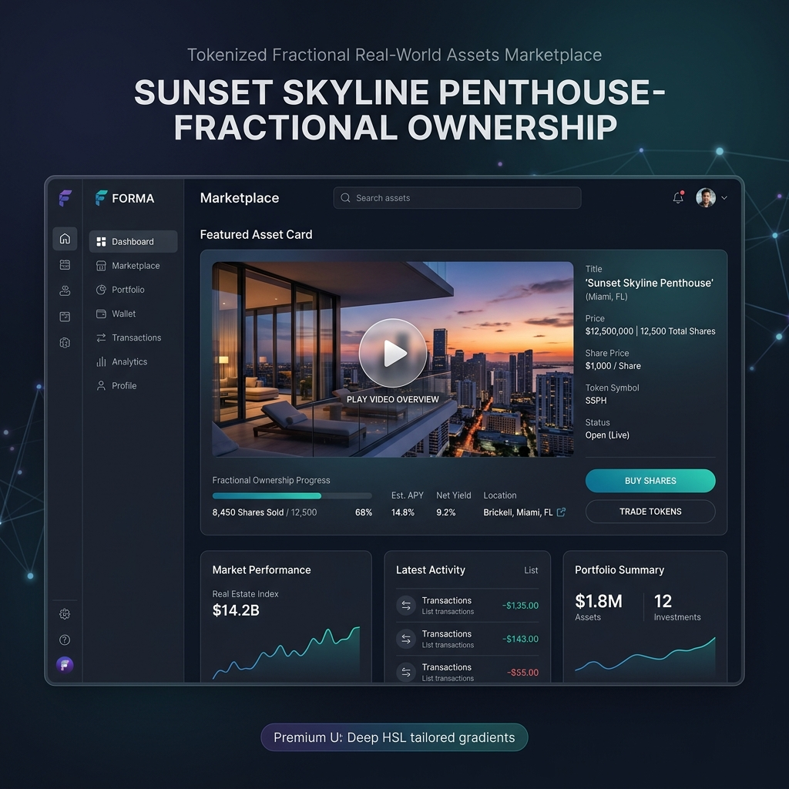
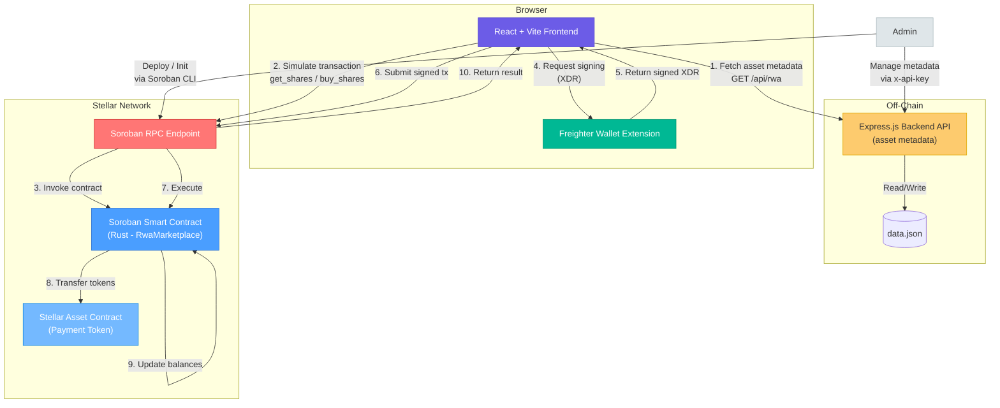

# Tokenized Fractional Real-World Assets (RWA) Marketplace

A full-stack decentralized application (dApp) built on the **Stellar Network** using **Soroban Smart Contracts**. This marketplace allows administrators to tokenize real-world assets into fractional shares for users to purchase.

## Walkthrough Demo

[](assets/marketplace_demo.webp)


## Architecture



### Data Flow — Buying Shares

| Step | Description |
|------|-------------|
| 1 | Frontend fetches asset metadata from the Backend API (`GET /api/rwa`) |
| 2 | User enters share amount and clicks "Buy Shares" |
| 3 | Frontend builds a `buy_shares` transaction and simulates it via Soroban RPC |
| 4 | Frontend sends the transaction XDR to Freighter Wallet for signing |
| 5 | User approves in Freighter; signed XDR is returned |
| 6 | Frontend submits the signed transaction to the Soroban RPC endpoint |
| 7 | Soroban Smart Contract executes `buy_shares`: validates availability, transfers payment tokens from buyer to admin |
| 8 | The Stellar Asset Contract (payment token) transfers the cost to the admin address |
| 9 | Contract updates the buyer's share balance and available shares count |
| 10 | Frontend refreshes the share balance via `get_shares` (simulate-only, no fee) |

## Project Structure

```
├── contracts/          # Soroban smart contract (Rust)
│   ├── Cargo.toml
│   └── lib.rs
├── backend/            # Off-chain metadata API (Express.js)
│   ├── package.json
│   ├── index.js
│   └── .env.example
├── frontend/           # React + Vite application
│   ├── package.json
│   ├── vite.config.js
│   ├── index.html
│   └── src/
│       ├── main.jsx
│       └── App.jsx
├── .gitignore
└── README.md
```

## Prerequisites

- Node.js (v18 or higher)
- Rust
- Soroban CLI (`cargo install --locked soroban-cli`)
- Freighter Wallet browser extension

## Getting Started

### 1. Build the Smart Contract

```bash
cd contracts
cargo build --target wasm32-unknown-unknown --release
# OR: soroban contract build
```

### 2. Run Tests

```bash
cd contracts
cargo test
```

### 3. Configure Testnet & Deploy

```bash
soroban network add --global testnet \
  --rpc-url https://soroban-testnet.stellar.org:443 \
  --network-passphrase "Test SDF Network ; September 2015"

soroban keys generate --global admin --network testnet

soroban contract deploy \
  --wasm target/wasm32-unknown-unknown/release/rwa_marketplace.wasm \
  --source admin \
  --network testnet
```

Copy the returned Contract ID (starts with `C`).

### 4. Initialize the Marketplace

```bash
soroban contract invoke \
  --id <YOUR_CONTRACT_ID> \
  --source admin \
  --network testnet \
  -- \
  init \
  --admin $(soroban keys address admin) \
  --payment_token CDLZFC3SYJYDZT7K67VZ75HPJVIEUVNIXF47ZG2FB2RMQQVU2HHGCYSC \
  --price 10000000 \
  --total_shares 100
```

### 5. Configure Environment

**Frontend** — copy and fill in `frontend/.env.example` as `frontend/.env`:

```env
VITE_CONTRACT_ID=<YOUR_CONTRACT_ID>
VITE_RPC_URL=https://soroban-testnet.stellar.org:443
VITE_NETWORK_PASSPHRASE="Test SDF Network ; September 2015"
VITE_API_URL=http://localhost:3001
```

**Backend** — copy and fill in `backend/.env.example` as `backend/.env`:

```env
PORT=3001
CORS_ORIGINS=http://localhost:5173
ADMIN_API_KEY=<generate-a-strong-random-key>
DATA_FILE=data.json
```

### 6. Run the Application

```bash
# Backend
cd backend
npm install
npm run dev

# Frontend (in a separate terminal)
cd frontend
npm install
npm run dev
```

Open `http://localhost:5173`, connect your Freighter wallet, and buy shares.

## Smart Contract API

| Function | Description | Auth |
|---|---|---|
| `init` | Initialize marketplace | Admin |
| `buy_shares` | Purchase fractional shares | Buyer |
| `get_shares` | Query user balance | None |
| `get_available_shares` | Query remaining shares | None |
| `get_total_shares` | Query total shares | None |
| `get_price` | Query price per share | None |
| `is_paused` | Check if paused | None |
| `pause` | Pause marketplace | Admin |
| `unpause` | Unpause marketplace | Admin |
| `emergency_withdraw` | Withdraw tokens from contract | Admin |

## Backend API

| Method | Endpoint | Auth | Description |
|---|---|---|---|
| `GET` | `/health` | No | Health check |
| `GET` | `/api/rwa` | No | List all assets |
| `GET` | `/api/rwa/:contractId` | No | Get asset metadata |
| `POST` | `/api/rwa` | `x-api-key` | Create/update asset |
| `DELETE` | `/api/rwa/:contractId` | `x-api-key` | Delete asset |

Interactive API documentation is available at [`/api-docs`](http://localhost:3001/api-docs) (Swagger UI) and [`/api-docs.json`](http://localhost:3001/api-docs.json) (raw OpenAPI spec) when the backend is running.
